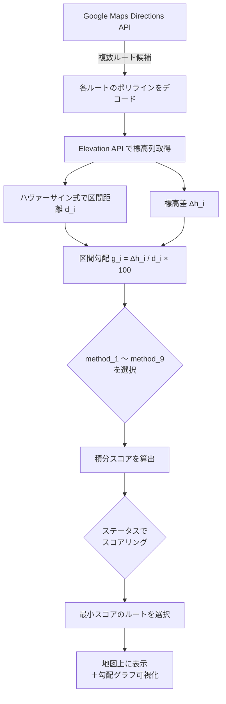
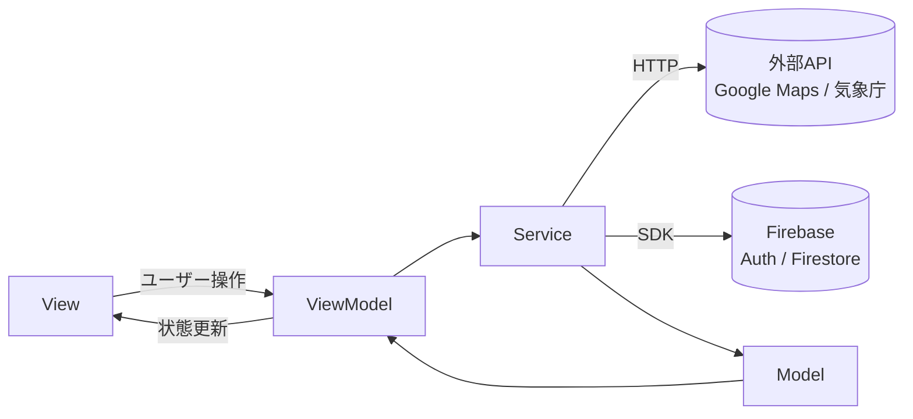
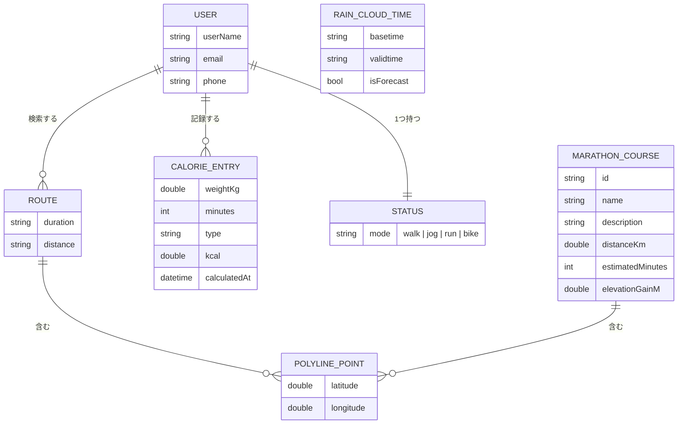

<!-- TODO: 共有いただいたスクリーンショットを docs/img/header.png に配置してコメントを外す -->
<!--  -->

<p align="center">
  
</p>

<h1 align="center">Arukeru / アルケール</h1>

<p align="center">
  <b>「歩行者に寄り添う」── 勾配に特化した歩行者専用地図アプリ</b>
</p>

<p align="center">
  
  
  
  
  
  
  
  
</p>

<br />

## 📑 目次

- [サービスのURL](#-サービスのurl)
- [開発の背景](#-開発の背景)
- [サービスへの想い](#-サービスへの想い)
- [アプリケーションのイメージ](#-アプリケーションのイメージ)
- [機能一覧](#-機能一覧)
- [勾配計算ロジック](#-勾配計算ロジック)
- [使用技術](#-使用技術)
- [アーキテクチャ](#-アーキテクチャ)
- [データモデル（ER図）](#-データモデルer図)
- [セットアップ手順](#-セットアップ手順)
- [CI/CD](#-cicd)
- [開発体制](#-開発体制)
- [今後の展望](#-今後の展望)

<br />

## 🔗 サービスのURL

- **Web版（PWA）**: https://aruke-ru-v2.web.app/

> PWA（Progressive Web App）として提供しており、ブラウザからインストールしてネイティブアプリのように利用できます。

<br />

## 🌱 開発の背景

アルケールは、**チャレンジキャラバン内のアイデアソンのイベント**をきっかけに生まれました。

チームで議論を重ねる中で「**坂が多くて歩きたくない**」という声が挙がり、そこを深掘りした結果「**勾配**」という切り口に行き着きました。既存の地図アプリは最短・最速ルートを提案しますが、**坂の緩やかさを基準にルートを選べるアプリは存在しない**という課題を発見。勾配計算に特化し、さまざまな歩行者属性に対応したサブ機能が充実した地図アプリの開発を決意しました。

|                | アルケール | Google マップ | OpenStreetMap |
| -------------- | :--------: | :-----------: | :-----------: |
| 勾配計算       |     ○      |       ○       |       ×       |
| ステータス設定 |     ○      |       △       |       ×       |
| 高度な計算手法 |     ○      |       ×       |       ×       |

<br />

## 💡 サービスへの想い

**「今ある景色をもっと豊かに、歩行者に寄り添う」**

ターゲットは**歩く人々すべて**。一般の歩行者だけでなく、高齢者・車いすユーザー・ベビーカー利用者・旅行者（外国人観光客含む）・ランナー・サイクリストまで、あらゆる属性の歩行者が快適に移動できる体験を届けることを目指しています。

ルート検索時にステータスを設定することで**ユーザーの属性に応じた最適ルート**を提案し、日本語・英語・韓国語の多言語対応により訪日観光客にも使いやすいアプリを実現します。

<br />

## 📱 アプリケーションのイメージ

<!-- TODO: 実機キャプチャ／GIFが用意でき次第差し替え -->

|                                                         ホーム画面（地図）                                                         |                                                        ルート検索・勾配計算                                                        |
| :--------------------------------------------------------------------------------------------------------------------------------: | :--------------------------------------------------------------------------------------------------------------------------------: |
|  |  |
|                   Googleマップを表示し、現在地・出発地・目的地を指定。ステータスに応じた最適ルートを提案します。                   |                  複数ルートを同時取得し、区間ごとに7種類の数値計算手法で勾配を算出。傾斜をグラフで可視化します。                   |

|                                                            雨雲レーダー                                                            |                                                           マラソンコース                                                           |
| :--------------------------------------------------------------------------------------------------------------------------------: | :--------------------------------------------------------------------------------------------------------------------------------: |
|  |  |
|                         気象庁データを元にしたリアルタイム雨雲を表示し、外出前の天候判断をサポートします。                         |                            地域のマラソンコースを地図上で確認できます（距離・推定時間・累積標高付き）。                            |

<br />

## 🧩 機能一覧

| 機能              | 概要                                                                                                                      |
| ----------------- | ------------------------------------------------------------------------------------------------------------------------- |
| 🗺️ ルート検索     | 出発地・目的地を入力し、Google Maps で複数ルートを表示。ステータスに応じた最適ルートを提案します。                        |
| 📐 勾配計算       | 区間ごとの勾配を **7種類の計算手法**（シンプソン法・台形則・フーリエ変換・リーマン計量 等）で算出し、傾斜を可視化します。 |
| 🚶 ステータス設定 | ウォーカー・ランナー・シニア・トラベラー等の属性を設定し、ユーザーに合ったルートを提案します。                            |
| 🌧️ 雨雲レーダー   | 気象庁データに基づいたリアルタイムの雨雲状況を確認し、外出判断をサポートします。                                          |
| 🏃 マラソンコース | 地域のマラソンコースを地図上で確認できます（距離・推定時間・累積標高付き）。                                              |
| 🔥 カロリー計算   | 歩行・ジョギング・ランニング・サイクリングの METs から消費カロリーを計算します。                                          |
| 🔐 認証           | Firebase Authentication によるメール＋パスワード認証でアカウントを管理します。                                            |
| 🌏 多言語対応     | アプリ全体のUIを日本語・英語・韓国語に切り替えられます（ARB形式）。                                                       |

<br />

## 📐 勾配計算ロジック

アルケールの中核は、独自実装の **勾配計算エンジン**（[`lib/viewmodels/map/gradient_calculator.dart`](lib/viewmodels/map/gradient_calculator.dart)）です。
ルート上の各区間について Google Maps の Elevation API から得た標高列と、ハヴァーサイン式で求めた水平距離から勾配を算出し、**ユーザー属性（ステータス）に応じてスコア化**して最適ルートを決定します。

### 1. 基本式：区間勾配（単純勾配を例に）

各区間の勾配 $g_i$（%）は、標高差を水平距離で割った値として定義します。

$$
g_i = \frac{\Delta h_i}{d_i} \times 100
$$

ここで $\Delta h_i = h_{i+1} - h_i$（標高差）、$d_i$ は区間の水平距離です。上りを正、下りを負として符号付きで保持します。

**単純勾配**（手法 #1）では $d_i$ を **50 m 固定**として近似し、全区間の絶対値を総和します。

$$
S = \sum_{i} \left| g_i \right| = \sum_{i} \left| \frac{\Delta h_i}{50} \right| \times 100
$$

この単純勾配を基礎として、区間距離の算出精度や積分手法を高度化したものが[3節の9手法](#3-9種類の勾配積分手法)です。

### 2. ステータス別スコアリング戦略（オリジナル）

「最も緩いルート」は属性ごとに定義が異なります。本アプリではユーザーの **`currentStatus`** に応じて以下4つのスコア関数を切り替え、**スコアが低いルートを優先選択**するように統一しています。

| ステータス                    | スコア関数           | 数式                           | 意図                                           |
| ----------------------------- | -------------------- | ------------------------------ | ---------------------------------------------- |
| 🚶 `walker` / ♿ `wheelchair` | 上り勾配の二乗和     | $S = \sum_{g_i > 0} g_i^2$     | 急坂に**強いペナルティ**（緩やか優先）         |
| 👵 `senior` / 👶 `stroller`   | 勾配絶対値の最大値   | $S = \max_i \lvert g_i \rvert$ | **最大傾斜を最小化**（ベビーカー・車いす想定） |
| 🏃 `runner`                   | 上り累積を**負値化** | $S = -\sum_{g_i > 0} g_i$      | 上りが多いほど**優先**（トレーニング志向）     |
| 🧳 `traveler`                 | 距離最短             | $S = D_{\text{total}}$         | 観光客向け、最短経路                           |

> **設計ポイント**: runner は本来「上りが多い＝高スコア」だが、他ステータスと同じく「低いほど優先」に統一するため負値化することで、ルート選択ロジック側の分岐を排除しています。

### 3. 9種類の勾配積分手法

ルート全体の "勾配の重さ" を評価する方式として、以下9手法を切り替え可能にしています（設定画面から選択）。すべて **「総スコアが最小のルート」** を返します。

|  #  | 手法                     | 概要                                                                                                          | 計算式（要点）                                                                                           |
| :-: | ------------------------ | ------------------------------------------------------------------------------------------------------------- | -------------------------------------------------------------------------------------------------------- |
|  1  | **単純勾配**             | 50 m 固定間隔で勾配絶対値を総和                                                                               | $S = \sum \lvert \Delta h_i / 50 \rvert \times 100$                                                      |
|  2  | **区分求積法**           | 区間長 × 高度差絶対値の総和（短冊面積）                                                                       | $S = \sum d_i \cdot \lvert \Delta h_i \rvert$                                                            |
|  3  | **線形計算**             | 区間勾配の絶対値の**平均**                                                                                    | $S = \dfrac{1}{N} \sum \lvert \Delta h_i / \sqrt{\Delta x_i^2 + \Delta y_i^2} \rvert$                    |
|  4  | **ベクトル積**           | 3D ベクトル $\vec{A}=(\Delta x, \Delta y, \Delta z)$ と水平射影 $\vec{B}=(\Delta x, \Delta y, 0)$ の角度      | $\theta_i = \arctan\!\left(\dfrac{\vec{A}\cdot\vec{B}}{\lVert\vec{A}\rVert\,\lVert\vec{B}\rVert}\right)$ |
|  5  | **ハヴァーサイン勾配角** | 地球曲率を考慮した正確な水平距離で勾配角を算出                                                                | $\theta_i = \arctan\!\left(\dfrac{\Delta h_i}{d_{\text{haversine}}}\right)$                              |
|  6  | **シンプソン法**         | 勾配関数 $f(x) = \lvert \Delta h / d \rvert$ を1/3則で数値積分                                                | $S \approx \dfrac{h}{3}\Big(f_0 + f_n + 4\!\sum_{\text{odd}} f_i + 2\!\sum_{\text{even}} f_i\Big)$       |
|  7  | **フーリエ変換 (FFT)**   | 標高列を周波数領域に変換し、**高周波成分エネルギー**で急変動を評価                                            | $S = \sum_{k=N/4}^{N/2} \lvert \mathcal{F}[h](k) \rvert$                                                 |
|  8  | **ヘルムホルツ分解**     | 勾配場をポテンシャル場 $\nabla\phi$ と回転場 $\nabla\times\vec{A}$ に分解し、ポテンシャル場のエネルギーを評価 | $S = \sum_i \lvert (\nabla\phi)_i \rvert$                                                                |
|  9  | **リーマン計量**         | $(x, y, z)$ 空間に計量テンソル $g_{ij}$ を導入し、**測地線長**を計算                                          | $S = \sum_i \sqrt{g_{xx}\,dx_i^2 + g_{yy}\,dy_i^2 + g_{zz}\,dz_i^2}$                                     |

### 4. ルート選択フロー



### 5. オリジナリティ

- **属性ベースのスコア統一化**：従来の地図アプリにはない「歩行者のタイプ」を一級概念として扱い、すべてのスコアを「低い＝優先」に**符号で揃えている**ため、ロジック分岐が不要。
- **複数の数学的アプローチを並置**：同じデータに対し「離散合計」「数値積分」「周波数解析」「微分幾何」を**ユーザーが切り替えて比較できる**実装は珍しく、教育・研究用途にも応用可能。
- **完全クライアントサイド計算**：標高列さえ取得すれば、サーバー側のルーティング再計算なしに任意の手法で再評価可能。

<br />

## 🛠 使用技術

| Category         | Technology Stack                                                                            |
| ---------------- | ------------------------------------------------------------------------------------------- |
| Language         | Dart `3.5+`                                                                                 |
| Framework        | Flutter `3.24.5`                                                                            |
| State Management | hooks_riverpod `2.5.1`, provider `6.1.2`                                                    |
| Auth / DB        | Firebase Authentication `5.3.3`, Cloud Firestore `5.5.0`, firebase_core `3.8.0`             |
| Maps & Location  | google_maps_flutter `2.9.0`, geolocator `13.0.1`                                            |
| Network          | http `1.2.2`                                                                                |
| UI / UX          | google_fonts `6.2.1`, flutter_spinkit `5.2.1`, settings_ui `2.0.2`, cupertino_icons `1.0.8` |
| 数式表示         | flutter_math_fork `0.7.4`                                                                   |
| 環境変数管理     | flutter_dotenv `5.2.1`                                                                      |
| 多言語対応       | flutter_localizations, l10n（ARB形式 ja / en / ko）                                         |
| 永続化           | shared_preferences `2.1.2`                                                                  |
| Architecture     | MVVM（Model / ViewModel / View）+ Riverpod Provider                                         |
| CI/CD            | GitHub Actions（`flutter analyze` + `flutter test`）                                        |
| Lint             | flutter_lints `4.0.0`                                                                       |
| Icon 生成        | flutter_launcher_icons `0.14.2`                                                             |

<br />

## 🏗 アーキテクチャ

本プロダクトは **MVVM + Riverpod** を採用しています。View はステートを持たず、ViewModel に処理を委譲。外部 I/O は Service 層に集約しています。

```
lib/
├── main.dart
├── firebase_options.dart
├── config/          # ルーティング・テーマ・Provider 定義
│   ├── routes.dart
│   ├── theme.dart
│   └── providers/   # auth / locale / status / sub / viewmodel
├── core/
│   ├── services/    # 外部 API・Firebase ラッパー
│   │   ├── auth_service.dart
│   │   ├── route_service.dart
│   │   ├── rain_cloud_service.dart
│   │   ├── marathon_course_service.dart
│   │   └── settings_service.dart
│   └── utils/       # api_client / dialog_helpers / validators
├── l10n/            # ja / en / ko の ARB ファイル + 生成コード
├── models/          # データモデル
├── viewmodels/      # ビジネスロジック・状態管理
│   ├── auth/        # sign_in / sign_up
│   ├── map/         # route / gradient_calculator / *_helper(web/stub)
│   └── settings/    # account / language / password / status
└── views/           # UI 層
    ├── app/         # ルート Widget
    ├── auth/        # サインイン・サインアップ
    ├── home/        # ホーム（地図・ルート検索）
    │   └── sub_extension/  # 雨雲・マラソン・カロリー
    ├── account/     # アカウント情報
    ├── settings/    # 各種設定
    └── widgets/     # 共通コンポーネント
```

### データフロー



<br />

## 🗂 データモデル（ER図）

主要モデル間の関係を示します（Firestore コレクション設計の基盤）。



<br />

## 🚀 セットアップ手順

### 必要環境

- Flutter SDK `3.24.5` 以上
- Dart SDK `3.5.0` 以上
- Xcode（iOS 開発時） / Android Studio（Android 開発時）
- Firebase プロジェクト（Authentication + Firestore 有効化）

### 1. リポジトリ取得

```bash
git clone https://github.com/<your-org>/Chikuhou_frontend.git
cd Chikuhou_frontend
```

### 2. 依存関係のインストール

```bash
flutter pub get
```

### 3. 環境変数の設定

リポジトリ直下に `.env` を配置します。

```env
GOOGLE_MAPS_API_KEY=your_google_maps_api_key
WEATHER_API_BASE_URL=https://www.jma.go.jp/bosai/...
```

### 4. Firebase 設定

```bash
# Firebase CLI 経由で各プラットフォーム設定ファイルを生成
flutterfire configure
```

### 5. アプリ実行

```bash
flutter run               # 接続中のデバイス／エミュレータで実行
flutter run -d chrome     # Web 版で実行
```

### 6. テスト・静的解析

```bash
flutter analyze
flutter test
```

<br />

## 🔄 CI/CD

`.github/workflows/code_quality.yml` にて、`main` への Pull Request 作成時に下記を自動実行します。

| ステップ             | 内容                                                         |
| -------------------- | ------------------------------------------------------------ |
| Checkout             | `actions/checkout@v3`                                        |
| Flutter セットアップ | `subosito/flutter-action@v2.3.0` (`flutter-version: 3.24.5`) |
| 依存解決             | `flutter pub get`                                            |
| 静的解析             | `flutter analyze`                                            |
| テスト               | `flutter test`                                               |

実行環境: `windows-latest`

<br />

## 👥 開発体制

| 項目           | 内容                    |
| -------------- | ----------------------- |
| プロジェクト名 | アルケール（Arukeru）   |
| 開発期間       | 2025年5月 〜 2025年12月 |

### メンバー

| 名前      | 所属                     | 担当           |
| --------- | ------------------------ | -------------- |
| 山内 敬太 | 九州工業大学             | バックエンド   |
| 越智 祐仁 | 麻生情報ビジネス専門学校 | フロントエンド |
| 前畑 遥哉 | 北九州市立大学           | フロントエンド |
| 藤木 弘也 | 北九州市立大学           | バックエンド   |

<br />

## 🌱 今後の展望

- **音声案内**：ルート案内を音声でガイドする機能を追加する。
- **口コミ機能**：スポットや経路に関するユーザーレビューを閲覧・投稿できる機能を追加する。
- **避難経路の確保**：ハザードマップを参照しながら、災害時の避難経路を確認できる機能を追加する。
- **簡単翻訳**：日本語・英語・韓国語間のインライン翻訳機能を追加する。
- **ルート履歴の保存**：過去に検索・走行したルートを Firestore に記録し、振り返り機能を実装する。
- **ウォーキングイベント連携**：地域のウォーキングイベント情報をアプリ内から確認・参加登録できる機能を追加する。
- **Apple Watch / Wear OS 対応**：ウェアラブルデバイスでのルート表示・通知機能を実装する。
- **Android / iOS ストアへのリリース**：TestFlight および Google Play 内部テストを経て、一般公開を目指す。

<br />

<p align="center">
  <sub>© Arukeru Project. Built with Flutter & Firebase.</sub>
</p>
